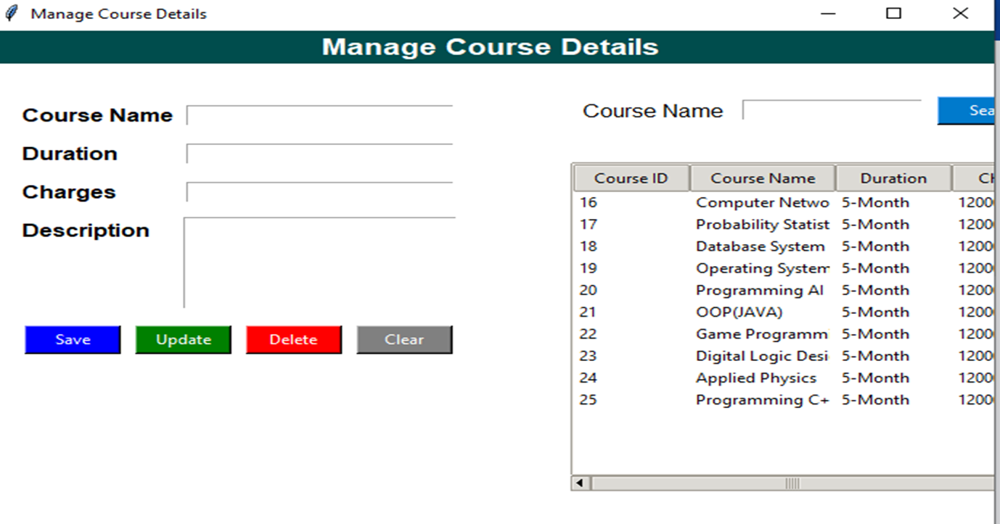

# **Aror University Student Result Management System**

> **A Comprehensive Academic Record Management Solution**

---

## **Project Objective**

**The Aror University Student Result Management System** is a **desktop application** designed to manage **student data, courses, results**, and **generate marksheets** for a university setting. It uses **Python** for the backend, **Tkinter** for the graphical user interface (GUI), **SQLite** for database management, and **ReportLab** for generating **PDF marksheets**. The system is **user-friendly, secure**, and designed to **streamline administrative tasks** related to student academic records.

---

## **Workflow**

**Login/Register:** Users must log in or register to access the system.

Upon successful login, they are directed to the **main dashboard.**

**Course Management:** Add or manage courses to be used in student and result modules.

**Student Management:** Register students with their details, linking them to available courses.

**Result Entry:** Input results for students, selecting courses and entering marks.

**View Results:** View or delete results, filtered by roll number if needed.

**Marksheet Generation:** Generate and download a marksheet as a PDF for a specific student.

**Logout/Exit:** Log out to return to the login screen or exit the application.

---

## **User Authentication**

**User Authentication (logout.py):** Provides **login and registration functionality.**

Users must register with a **name, email, and password**, stored securely in an **SQLite database.**

Validates **login credentials** and redirects to the main dashboard upon successful login.

Includes **placeholder text** for better user experience and a **terms agreement checkbox** for registration.

---

## **Dashboard**

Provides a **central interface** with a **sidebar menu** to access all modules (**Course, Student, Result, View Results, Marksheet, Logout, Exit**). 

Displays **dashboard cards** showing **counts of students, courses, and results.**

Uses **modern styling with hover effects** and **responsive design.**

**Database Management (database.py):** Initializes an **SQLite database (AROR_University_Result_System.db)** with tables for **users, students, courses, and results.**

Enforces **data integrity** with **primary keys, unique constraints, and foreign keys.**

Includes a **check to add the enrollment column** to the students table if it doesn't exist.

---

## **Course.py**

Allows **adding, updating, deleting, and searching courses.**

Stores **course details** (name, duration, charges, description) in the **SQLite database.**

Displays **courses in a table** with scrollbars and supports selecting a course to edit.

---

## **Student**

Manages **student details** such as roll number, name, email, gender, date of birth, contact, course, admission date, father’s name, exam month/year, enrollment, and year/semester.

Supports **adding, updating, deleting, and searching students by roll number.**

Includes a **dropdown for selecting courses** from the database.

---

## **Result**

